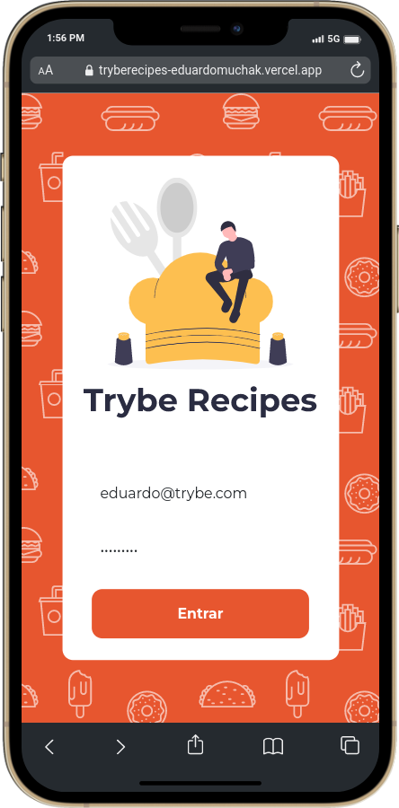
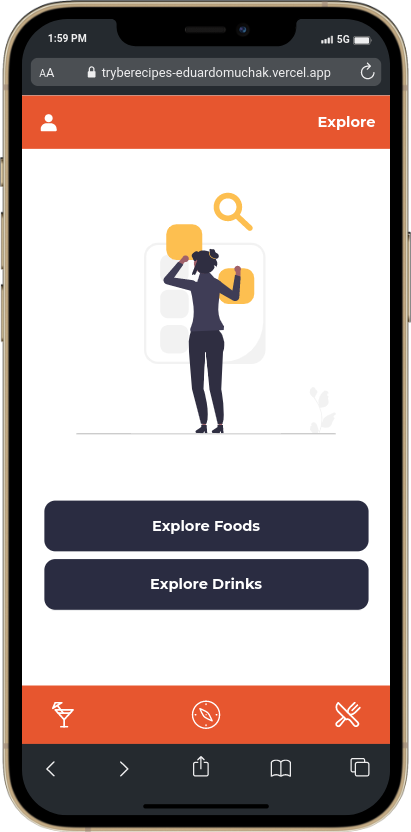
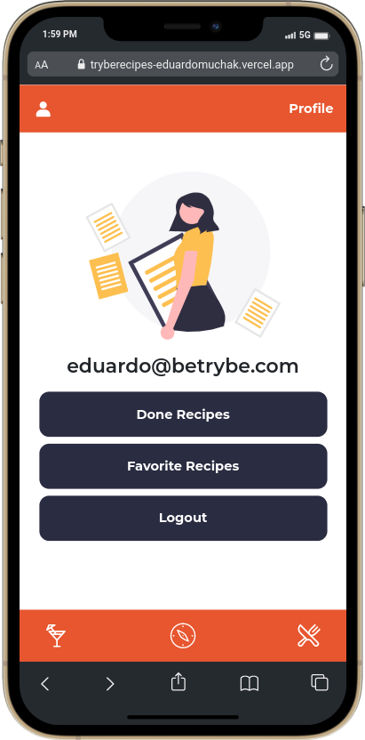
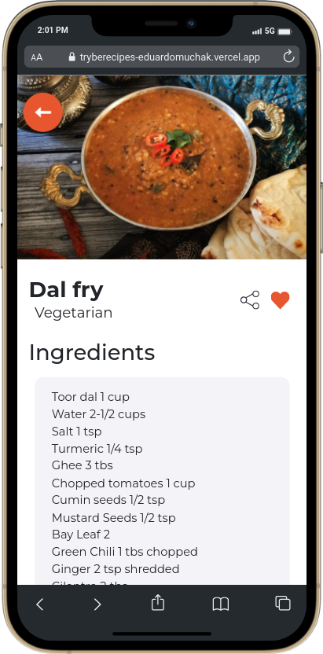

# Trybe Recipes

<p align="center">
  
</p>
</br>

### About:

Projeto de conclusão do Módulo de Front End do curso da Trybe.

This project consists of creating a mobile application that can help a user when searching and preparing drinks and meals.

Since the beginning of the project, we have always maintained a lot of respect and collaboration between all the people who are part of the team. It was also a huge organizational and communication challenge to keep all people aligned with the progress of the project, because after all, there were 87 requirements to be completed.

So we use some agile methodologies such as Kanban and Scrum to keep the project progress more efficient and transparent. The experience was excellent and we learned a lot from it.

In the application, we use ReactJS, ContextAPI for managing global states, TailwindCSS for styling paying attention to accessibility in WCAG 2.1 standards and React Testing Library for application testing. We also had to deal with information from 2 different API's (TheCocktailDB and TheMealDB) to supply the application with the recipe information.

### Team:

- [Bruno Roja](https://www.linkedin.com/in/brunojlee/)
- [Eduardo Muchak](https://www.linkedin.com/in/eduardomuchak/)
- [Leonardo Begnossi](https://www.linkedin.com/in/leonardo-begnossi-41580a127/)
- [Leonardo Diman](https://www.linkedin.com/in/leonardo-diman-martins-b16439173/)
- [Rafaela Jordão](https://www.linkedin.com/in/jordaorafaela/)

### Aplication

[Click here](https://tryberecipes-eduardomuchak.vercel.app/) to view the final version of our project in your browser.
Note: It is necessary to enable the mobile view mode if you're on a computer.

[Click here](https://www.figma.com/file/XQlM0bZO6lCxGkMJs4XZNw/Trybe-Recipes) to view Figma developed for the visual part of the application.

### Development Notes:

- The project is still under development. Desktop mode is not yet implemented and tablet mode is still not as the team wants.

### Progress

- [x] Programming logic for application operation
- [x] Interface development (Mobile First)
- [ ] Interface improvement for bigger screens (Tablets and Desktops).
- [x] Implementing unit tests with React Testing Library.

## Technologies:

- Context API
- JavaScript ES6+
- React.js
- React Router
- React Icons (Icon library)
- React Testing Library (RTL)
- TailwindCSS
- Vercel

## Methodologies:

- Mobile First
- Kanban
- Scrum

## How to run the application:

To download the code:

```
git clone git@github.com:eduardomuchak/19-trybe-recipes.git
```

Enter the project root folder:

```
cd 19-trybe-recipes
```

Install the dependencies:

```
npm install
```

Launch the application in your browser:

```
npm start
```

## Screenshots:

<p align="center">
  
</p>
</br>
<p align="center">
  
</p>
</br>
<p align="center">
  
</p>
</br>
<p align="center">
  
</p>
